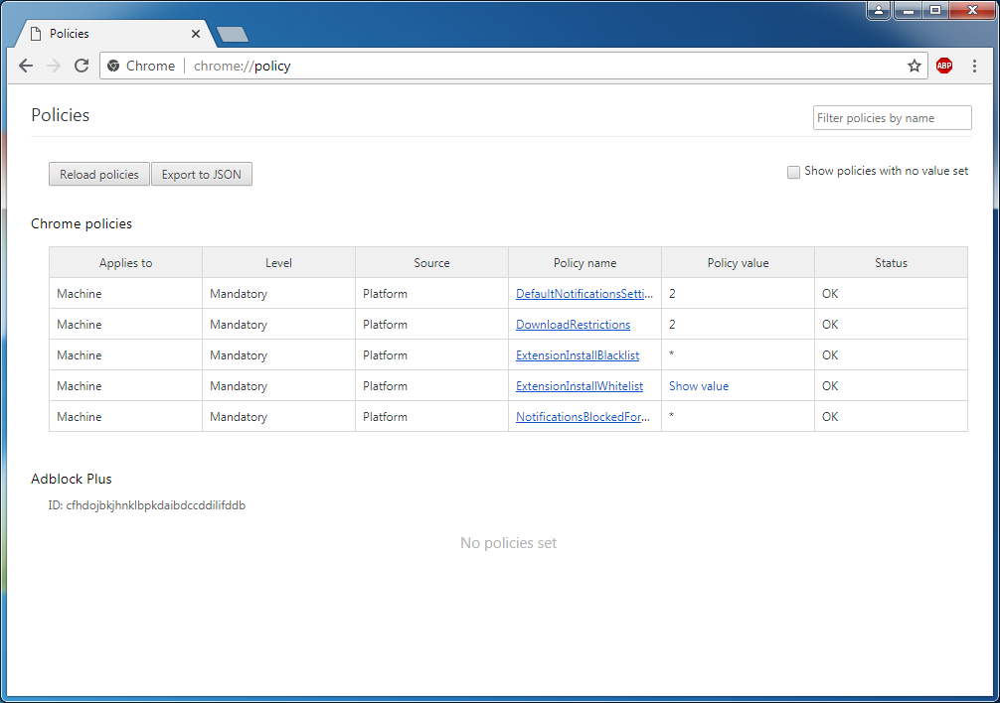

What does this do?
==================
The purpose of the files found in this repository is to configure Google Chrome on Windows with some more conservative defaults; namely:

* Block all potentially dangerous downloads (regardless of distribution point)
* Block websites being able to request permission to use the notifications API
* Block all extensions being installed (with the exception of [Adblock Plus](https://adblockplus.org/))

Why would I want to do this?
============================
For most people familiar with the dangers of the web, these settings are null and void. If, however, you have friends or family (young children, elderly relatives etc.) that struggle to recognise phishing attacks and malware, it can be of great use to them for you to help introduce a more restrictive environment to protect them.

By introducing these settings, they will be protected from drive-by extension installations; which if they were to fall victim to would allow an attacker to intercept all their traffic and perform actions in their browser.

In addition to protecting from malicious extension installations, the blocking of the notifications API will also prevent them being spammed by domains they land on that try to push adware and malicious URLs via Chrome notifications.

Lastly, the blocking of dangerous downloads is the more commonly known - if they download a malicious executable, bad things can happen. The blocking of potentially dangerous downloads will not make exceptions based on the distribution point. So, if an `exe` is being served from Google themselves, it will still be blocked (this will not block updates).

How do I install it?
====================
It's very simple - just double click the appropriate `.reg` file and click "Yes" to the prompts!

There are two installation files to choose from, which are:

* `secure_chrome_all_users_install.reg` - install the policies for *all* users of the machine.
* `secure_chrome_current_user_install.reg` - install the policies for only the *current* user of the machine.

To verify the installation was successful, open Google Chrome and in the URL bar enter `chrome://policy`.

After the page loads, you should see the following policies in place if you installed for all users:



Alternatively, if you installed for the current user, it will look like this:


Compatibility
=============
The policies installed by these registry files have been tested on:

* Windows 7 Home Premium / Google Chrome 67.0.3396.99

The policies are officially supported by the Chromium project, as can be seen from [The Documentation for Administrators](https://www.chromium.org/administrators/policy-list-3), so it is unlikely support for them will be removed in the future.

Troubleshooting
===============
If the user you are running as is not an administrator, then you may run into issues trying to install for only the current user.

The reason for this, is that when you run `regedit` in an elevated prompt, it will install the policies to the administrator user's local settings instead.

In this event, you can either:

1. Temporarily make the user an administrator to allow them to run the `.reg` file
2. Run the installer to apply the policies to all users

I've changed my mind, how do I remove this?
===========================================
To restore Google Chrome back to it's default state, run one of the following two files:

* `secure_chrome_all_users_uninstall.reg` - run this if you installed for all users of the machine.
* `secure_chrome_current_user_uninstall.reg` - run this if you installed for the current user of the machine.

Why is Adblock Plus whitelisted?
================================
It's an extension that I suspect the majority of people use and would want whitelisted out of the box. A good ad-blocker can be of use in keeping unsuspecting users from hitting click-bait and ending up in dangerous waters, so I felt it is appropriate to whitelist an extension that works well for this purpose.

How can I whitelist more extensions?
====================================
If you'd like to whitelist more extensions, you can do so by adding new keys under the `ExtensionInstallWhitelist` node.

The key is an incrementing numeric value, if you were to add a second key, it's named would be `2`. The value stored in it is the extension ID that can be found in the Chrome Web Store URL.

For example, the store page for [LastPass](https://chrome.google.com/webstore/detail/lastpass-free-password-ma/hdokiejnpimakedhajhdlcegeplioahd) contains the value `hdokiejnpimakedhajhdlcegeplioahd` at the end of the URL; this is the identifier.

If we were to add this to the whitelisted extensions, the `ExtensionInstallWhitelist` node definition would then look like this:

```ini
[HKEY_CURRENT_USER\Software\Policies\Google\Chrome\ExtensionInstallWhitelist]
"1"="cfhdojbkjhnklbpkdaibdccddilifddb"
"2"="hdokiejnpimakedhajhdlcegeplioahd"
```

After making changes, you will need to either restart Google Chrome or click the `Reload policies` button on the `chrome://policy` page.
